### Chaos Studio

##### tl;dr
Chaos Theory can generate some cool and interesting art. Go [explore](http://chaos-studio.io/#/explore) for yourself!

##### Introduction
Many years ago when I was a kid, I remember being at a flea market in Vermont, and picking up a 
book [(Strange Attractors:
Creating Patterns in Chaos by Julien C. Sprott)](http://sprott.physics.wisc.edu/sa.htm) that had intrigued me.  Inside of it were 
depictions of very exotic looking figures, stringy line art, and patterned blobs.  As I delved 
deeper into the book, I realized that it provided step-by-step BASIC code for generating these 
figures and finding new ones!  At the time I had only dabbled a tiny bit in BASIC, so I thought 
this book would be a fun challenge with very cool results.

At first the mathematical concepts in the book were hard to grasp, but as my education evolved 
over the years, so did my understanding of the book.  The implementations of the program had 
also evolved, starting in BASIC, then later, Visual Basic, after that C#, and now finally, 
JavaScript.  I had put together a crude Silverlight application in 2011. Since Silverlight is 
a dying technology, and, I wanted to be able to give more control to the user, it was clear 
that a rewrite was in order.


The result is a fully open source site, with state of the art web technology that is compatible 
across most browsers without needing to install plugins, and, running using WebGL for fast 
rendering of millions of points on the GPU.  I've also added a great bit of knobs and dials that 
the enthusiast can play with, or, even contribute code for.


My hope is that others can enjoy and appreciate the beauty of chaos theory as I have over the 
years.  I owe a lot of my desire to learn programming to this hobby as well as my general interest 
in mathematics and specifically chaos theory. 

##### Chaos Theory
So what are strange attractors?  To answer this question, I'm going to take a step back and talk
about what chaos theory is first.  Chaos theory is a branch of mathematics that deals with
systems that evolve over time and have a sensitivity to small changes in initial conditions.
A common phrase used is the 'butterfly effect', where changing one small thing could ultimately
compound and result in big changes.  Weather is a good example of a system that chaos theory
studies.  Weather is hard to predict because of the huge number of variables involved in
predicting the entire system.  That's not to say that a system must have a lot of variables
to exhibit chaos.  One of the simplest equations that exhibits chaos is the Logistic Equation:

```math
X(n+1) = R * X(n) * (1 - X(n))
```

By picking some reasonable initial value `X(0)` and setting `R = 4`, you can demonstrate that
the equation is chaotic.  If you were to pick `X(0) = 0.2` and `R = 4`, plug in the values,
and plug in the result in subsequent iterations, here are some of the values you would see:

```math
4 * 0.2 * 0.8 = 0.64
4 * 0.64 * 0.36 = 0.9216
4 * 0.9216 * 0.0784 = 0.2890
4 * 0.2890 * 0.711 = 0.8219
4 * 0.8219 * 0.1781 = 0.5855
```

Overall, the numbers just seem to bounce around different values without any real predictable
pattern. If you were to pick `X(0) = 0.2` and `R = 2` the system now no longer exhibits chaos:

```math
2 * 0.2 * 0.8 = 0.32
2 * 0.32 * 0.68 = 0.4352
2 * 0.4352 * 0.5648 = 0.4916
2 * 0.4916 * 0.5084 = 0.4999
2 * 0.4999 * 0.5001 = 0.5
```

In fact, now, it seems to converge to the value `0.5`.  All this, by simply changing one
variable, `R`!

In both examples above, the points generated by the equation 'attract' towards a basin of
attraction.  In the second example, this basin in a single point at value `0.5`, in the first
example, this basin is a set of infinitely many different point values.

If you want to play around with visualization of different values of `R` and `X(0)`, you can try it out [here](http://chaos-studio.io/#/logistic).

##### Strange Attractors
Now to make the cognitive leap: the strange attractors on this site use more complex equations
in three dimensions `X, Y, Z`, rather than just the one dimension `X`.  The three-dimensional
shape you see is the three-dimensional basin of attraction for a strange attractor.  Similar to
how we could tweak `R` to make the equation exhibit different basins of attraction, for an
equation like the 'Quadratic Map', there's thirty different values you can tweak, leading to an
immense amount of variety!

When you search for a new strange attractor, the site is randomly picking coefficient values
until if finds an attractor that exhibits certain aesthetic qualities.  More specifically, you
might consider an attractor aesthetically pleasing if it doesn't settle to a single point and
if the attractor doesn't diverge off into infinity and instead stays within a bounded space.

There's an endless number of simple and complex equations that you can come up with, for which
one could find strange attractors.  One of the many reasons I wanted to open source this
site is so that others can contribute their interesting equations.  This is only a small glimpse of
what chaos theory is about and how these strange attractors are generated, but hopefully enough
to get a general idea of how it all works.

##### Samples
Below is a sampling of all the attractors you can generate on this site.  Clicking on the image will
take you to the explore page, where the attractor will be generated for you!

###### Lorenz
[](http://chaos-studio.io/#/explore/PDE3OkF0dHJhY3RvclNuYXBzaG90MzptYXA8OTpMb3JlbnpNYXA+Mzpybmc8Mjc6TGluZWFyQ29uZ3J1ZW50aWFsR2VuZXJhdG9yNDpzZWVkKDE1MDYxOTkxMTM5MDkpPj4=)
[](http://chaos-studio.io/#/explore/PDE3OkF0dHJhY3RvclNuYXBzaG90MzptYXA8OTpMb3JlbnpNYXA+Mzpybmc8Mjc6TGluZWFyQ29uZ3J1ZW50aWFsR2VuZXJhdG9yNDpzZWVkKDE1MDYxOTkzNjcwNzYpPj4=)
[](http://chaos-studio.io/#/explore/PDE3OkF0dHJhY3RvclNuYXBzaG90MzptYXA8OTpMb3JlbnpNYXA+Mzpybmc8Mjc6TGluZWFyQ29uZ3J1ZW50aWFsR2VuZXJhdG9yNDpzZWVkKDE1MDYxOTk0MzA5NjQpPj4=)
[](http://chaos-studio.io/#/explore/PDE3OkF0dHJhY3RvclNuYXBzaG90MzptYXA8OTpMb3JlbnpNYXA+Mzpybmc8Mjc6TGluZWFyQ29uZ3J1ZW50aWFsR2VuZXJhdG9yNDpzZWVkKDE1MDYxOTk1NDI2MjQpPj4=)

###### Rössler
[](http://chaos-studio.io/#/explore/PDE3OkF0dHJhY3RvclNuYXBzaG90MzptYXA8MTA6Um9zc2xlck1hcD4zOnJuZzwyNzpMaW5lYXJDb25ncnVlbnRpYWxHZW5lcmF0b3I0OnNlZWQoMTUwNjIwMTkyNTk2NSk+Pg==)
[](http://chaos-studio.io/#/explore/PDE3OkF0dHJhY3RvclNuYXBzaG90MzptYXA8MTA6Um9zc2xlck1hcD4zOnJuZzwyNzpMaW5lYXJDb25ncnVlbnRpYWxHZW5lcmF0b3I0OnNlZWQoMTUwNjIwMjQxNjg1Nik+Pg==)
[](http://chaos-studio.io/#/explore/PDE3OkF0dHJhY3RvclNuYXBzaG90MzptYXA8MTA6Um9zc2xlck1hcD4zOnJuZzwyNzpMaW5lYXJDb25ncnVlbnRpYWxHZW5lcmF0b3I0OnNlZWQoMTUwNjIwMjU1ODk1OSk+Pg==)
[](http://chaos-studio.io/#/explore/PDE3OkF0dHJhY3RvclNuYXBzaG90MzptYXA8MTA6Um9zc2xlck1hcD4zOnJuZzwyNzpMaW5lYXJDb25ncnVlbnRpYWxHZW5lcmF0b3I0OnNlZWQoMTUwNjIwMjYxODY5NCk+Pg==)

###### Hénon
[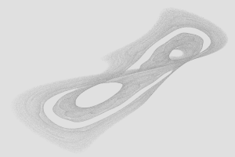](http://chaos-studio.io/#/explore/PDE3OkF0dHJhY3RvclNuYXBzaG90MzptYXA8ODpIZW5vbk1hcD4zOnJuZzwyNzpMaW5lYXJDb25ncnVlbnRpYWxHZW5lcmF0b3I0OnNlZWQoMTUwNjE5ODcxODcwNCk+Pg==)
[](http://chaos-studio.io/#/explore/PDE3OkF0dHJhY3RvclNuYXBzaG90MzptYXA8ODpIZW5vbk1hcD4zOnJuZzwyNzpMaW5lYXJDb25ncnVlbnRpYWxHZW5lcmF0b3I0OnNlZWQoMTUwNjE5ODg3NDE4OSk+Pg==)
[](http://chaos-studio.io/#/explore/PDE3OkF0dHJhY3RvclNuYXBzaG90MzptYXA8ODpIZW5vbk1hcD4zOnJuZzwyNzpMaW5lYXJDb25ncnVlbnRpYWxHZW5lcmF0b3I0OnNlZWQoMTUwNjE5OTAwMDUxMCk+Pg==)
[](http://chaos-studio.io/#/explore/PDE3OkF0dHJhY3RvclNuYXBzaG90MzptYXA8ODpIZW5vbk1hcD4zOnJuZzwyNzpMaW5lYXJDb25ncnVlbnRpYWxHZW5lcmF0b3I0OnNlZWQoMTUwNjE5OTA0NDE0MCk+Pg==)

###### Quadratic
[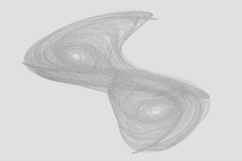](http://chaos-studio.io/#/explore/PDE3OkF0dHJhY3RvclNuYXBzaG90MzptYXA8MTI6UXVhZHJhdGljTWFwPjM6cm5nPDI3OkxpbmVhckNvbmdydWVudGlhbEdlbmVyYXRvcjQ6c2VlZCgxNTA2MTg0MzU5ODQ1KT4+)
[](http://chaos-studio.io/#/explore/PDE3OkF0dHJhY3RvclNuYXBzaG90MzptYXA8MTI6UXVhZHJhdGljTWFwPjM6cm5nPDI3OkxpbmVhckNvbmdydWVudGlhbEdlbmVyYXRvcjQ6c2VlZCgxNTA2MTg0NTU0NzExKT4+)
[](http://chaos-studio.io/#/explore/PDE3OkF0dHJhY3RvclNuYXBzaG90MzptYXA8MTI6UXVhZHJhdGljTWFwPjM6cm5nPDI3OkxpbmVhckNvbmdydWVudGlhbEdlbmVyYXRvcjQ6c2VlZCgxNTA2MTg0NzIyNzQyKT4+)
[](http://chaos-studio.io/#/explore/PDE3OkF0dHJhY3RvclNuYXBzaG90MzptYXA8MTI6UXVhZHJhdGljTWFwPjM6cm5nPDI3OkxpbmVhckNvbmdydWVudGlhbEdlbmVyYXRvcjQ6c2VlZCgxNTA2MTg0Nzc1NDIwKT4+)

###### Cubic
[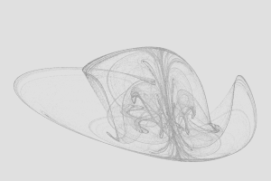](http://chaos-studio.io/#/explore/PDE3OkF0dHJhY3RvclNuYXBzaG90MzptYXA8ODpDdWJpY01hcD4zOnJuZzwyNzpMaW5lYXJDb25ncnVlbnRpYWxHZW5lcmF0b3I0OnNlZWQoMTUwNjE4NjQ2OTkzNik+Pg==)
[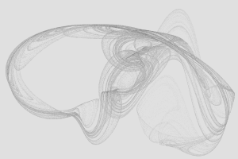](http://chaos-studio.io/#/explore/PDE3OkF0dHJhY3RvclNuYXBzaG90MzptYXA8ODpDdWJpY01hcD4zOnJuZzwyNzpMaW5lYXJDb25ncnVlbnRpYWxHZW5lcmF0b3I0OnNlZWQoMTUwNjE4NjYxNDYyNik+Pg==)
[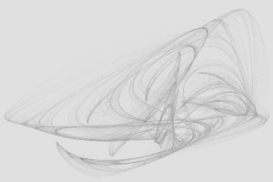](http://chaos-studio.io/#/explore/PDE3OkF0dHJhY3RvclNuYXBzaG90MzptYXA8ODpDdWJpY01hcD4zOnJuZzwyNzpMaW5lYXJDb25ncnVlbnRpYWxHZW5lcmF0b3I0OnNlZWQoMTUwNjE4NjcyMjQ1Mik+Pg==)
[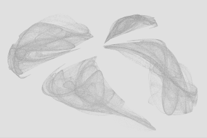](http://chaos-studio.io/#/explore/PDE3OkF0dHJhY3RvclNuYXBzaG90MzptYXA8ODpDdWJpY01hcD4zOnJuZzwyNzpMaW5lYXJDb25ncnVlbnRpYWxHZW5lcmF0b3I0OnNlZWQoMTUwNjE4NzI0NTQyMCk+Pg==)

###### Quartic (Polynomial, degree=4)
[](http://chaos-studio.io/#/explore/PDE3OkF0dHJhY3RvclNuYXBzaG90MzptYXA8MTM6UG9seW5vbWlhbE1hcDY6ZGVncmVlKDQpPjM6cm5nPDI3OkxpbmVhckNvbmdydWVudGlhbEdlbmVyYXRvcjQ6c2VlZCgxNTA2MjEzNTg4Njg0KT4+)
[](http://chaos-studio.io/#/explore/PDE3OkF0dHJhY3RvclNuYXBzaG90MzptYXA8MTM6UG9seW5vbWlhbE1hcDY6ZGVncmVlKDQpPjM6cm5nPDI3OkxpbmVhckNvbmdydWVudGlhbEdlbmVyYXRvcjQ6c2VlZCgxNTA2MjEzNzUyMDk4KT4+)
[](http://chaos-studio.io/#/explore/PDE3OkF0dHJhY3RvclNuYXBzaG90MzptYXA8MTM6UG9seW5vbWlhbE1hcDY6ZGVncmVlKDQpPjM6cm5nPDI3OkxpbmVhckNvbmdydWVudGlhbEdlbmVyYXRvcjQ6c2VlZCgxNTA2MjEzODE5MDgyKT4+)
[](http://chaos-studio.io/#/explore/PDE3OkF0dHJhY3RvclNuYXBzaG90MzptYXA8MTM6UG9seW5vbWlhbE1hcDY6ZGVncmVlKDQpPjM6cm5nPDI3OkxpbmVhckNvbmdydWVudGlhbEdlbmVyYXRvcjQ6c2VlZCgxNTA2MjE0MDY4MTI1KT4+)

###### Quintic (Polynomial, degree=5)
[](http://chaos-studio.io/#/explore/PDE3OkF0dHJhY3RvclNuYXBzaG90MzptYXA8MTM6UG9seW5vbWlhbE1hcDY6ZGVncmVlKDUpPjM6cm5nPDI3OkxpbmVhckNvbmdydWVudGlhbEdlbmVyYXRvcjQ6c2VlZCgxNTA2MjE0MTMyNDI4KT4+)
[](http://chaos-studio.io/#/explore/PDE3OkF0dHJhY3RvclNuYXBzaG90MzptYXA8MTM6UG9seW5vbWlhbE1hcDY6ZGVncmVlKDUpPjM6cm5nPDI3OkxpbmVhckNvbmdydWVudGlhbEdlbmVyYXRvcjQ6c2VlZCgxNTA2MjE0MjcwOTgyKT4+)
[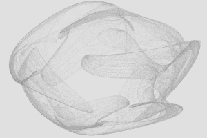](http://chaos-studio.io/#/explore/PDE3OkF0dHJhY3RvclNuYXBzaG90MzptYXA8MTM6UG9seW5vbWlhbE1hcDY6ZGVncmVlKDUpPjM6cm5nPDI3OkxpbmVhckNvbmdydWVudGlhbEdlbmVyYXRvcjQ6c2VlZCgxNTA2MjE0NDUwMDAwKT4+)
[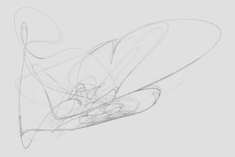](http://chaos-studio.io/#/explore/PDE3OkF0dHJhY3RvclNuYXBzaG90MzptYXA8MTM6UG9seW5vbWlhbE1hcDY6ZGVncmVlKDUpPjM6cm5nPDI3OkxpbmVhckNvbmdydWVudGlhbEdlbmVyYXRvcjQ6c2VlZCgxNTA2MjI2ODQ3MjE1KT4+)

###### Decic (Polynomial, degree=10)
[](http://chaos-studio.io/#/explore/PDE3OkF0dHJhY3RvclNuYXBzaG90MzptYXA8MTM6UG9seW5vbWlhbE1hcDY6ZGVncmVlKDEwKT4zOnJuZzwyNzpMaW5lYXJDb25ncnVlbnRpYWxHZW5lcmF0b3I0OnNlZWQoMTUwNjIxNzIwMzgzNik+Pg==)
[](http://chaos-studio.io/#/explore/PDE3OkF0dHJhY3RvclNuYXBzaG90MzptYXA8MTM6UG9seW5vbWlhbE1hcDY6ZGVncmVlKDEwKT4zOnJuZzwyNzpMaW5lYXJDb25ncnVlbnRpYWxHZW5lcmF0b3I0OnNlZWQoMTUwNjIxNzM3MDQyNik+Pg==)
[](http://chaos-studio.io/#/explore/PDE3OkF0dHJhY3RvclNuYXBzaG90MzptYXA8MTM6UG9seW5vbWlhbE1hcDY6ZGVncmVlKDEwKT4zOnJuZzwyNzpMaW5lYXJDb25ncnVlbnRpYWxHZW5lcmF0b3I0OnNlZWQoMTUwNjIxNzUyMDczOSk+Pg==)
[](http://chaos-studio.io/#/explore/PDE3OkF0dHJhY3RvclNuYXBzaG90MzptYXA8MTM6UG9seW5vbWlhbE1hcDY6ZGVncmVlKDEwKT4zOnJuZzwyNzpMaW5lYXJDb25ncnVlbnRpYWxHZW5lcmF0b3I0OnNlZWQoMTUwNjIxNzgzNzU5Mik+Pg==)

###### Quadratic ODE
[](http://chaos-studio.io/#/explore/PDE3OkF0dHJhY3RvclNuYXBzaG90MzptYXA8MTU6UXVhZHJhdGljT2RlTWFwPjM6cm5nPDI3OkxpbmVhckNvbmdydWVudGlhbEdlbmVyYXRvcjQ6c2VlZCgxNTA2MjAzODI2MzU1KT4+)
[](http://chaos-studio.io/#/explore/PDE3OkF0dHJhY3RvclNuYXBzaG90MzptYXA8MTU6UXVhZHJhdGljT2RlTWFwPjM6cm5nPDI3OkxpbmVhckNvbmdydWVudGlhbEdlbmVyYXRvcjQ6c2VlZCgxNTA2MjA0MDQ1MDk1KT4+)
[](http://chaos-studio.io/#/explore/PDE3OkF0dHJhY3RvclNuYXBzaG90MzptYXA8MTU6UXVhZHJhdGljT2RlTWFwPjM6cm5nPDI3OkxpbmVhckNvbmdydWVudGlhbEdlbmVyYXRvcjQ6c2VlZCgxNTA2MjA0MzE5OTY3KT4+)
[](http://chaos-studio.io/#/explore/PDE3OkF0dHJhY3RvclNuYXBzaG90MzptYXA8MTU6UXVhZHJhdGljT2RlTWFwPjM6cm5nPDI3OkxpbmVhckNvbmdydWVudGlhbEdlbmVyYXRvcjQ6c2VlZCgxNTA2MjA0NDIzMTg5KT4+)

###### Cubic ODE
[](http://chaos-studio.io/#/explore/PDE3OkF0dHJhY3RvclNuYXBzaG90MzptYXA8MTE6Q3ViaWNPZGVNYXA+Mzpybmc8Mjc6TGluZWFyQ29uZ3J1ZW50aWFsR2VuZXJhdG9yNDpzZWVkKDE1MDYyMDUxMDUwNDkpPj4=)
[](http://chaos-studio.io/#/explore/PDE3OkF0dHJhY3RvclNuYXBzaG90MzptYXA8MTE6Q3ViaWNPZGVNYXA+Mzpybmc8Mjc6TGluZWFyQ29uZ3J1ZW50aWFsR2VuZXJhdG9yNDpzZWVkKDE1MDYyMDUxNzA0NzIpPj4=)
[](http://chaos-studio.io/#/explore/PDE3OkF0dHJhY3RvclNuYXBzaG90MzptYXA8MTE6Q3ViaWNPZGVNYXA+Mzpybmc8Mjc6TGluZWFyQ29uZ3J1ZW50aWFsR2VuZXJhdG9yNDpzZWVkKDE1MDYyMDUyNzkzNTcpPj4=)
[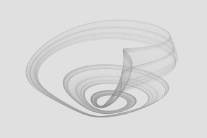](http://chaos-studio.io/#/explore/PDE3OkF0dHJhY3RvclNuYXBzaG90MzptYXA8MTE6Q3ViaWNPZGVNYXA+Mzpybmc8Mjc6TGluZWFyQ29uZ3J1ZW50aWFsR2VuZXJhdG9yNDpzZWVkKDE1MDYzOTcyNDk0MzUpPj4=)

###### Quartic ODE (Polynomial ODE, degree=4)
[](http://chaos-studio.io/#/explore/PDE3OkF0dHJhY3RvclNuYXBzaG90MzptYXA8MTY6UG9seW5vbWlhbE9kZU1hcDY6ZGVncmVlKDQpPjM6cm5nPDI3OkxpbmVhckNvbmdydWVudGlhbEdlbmVyYXRvcjQ6c2VlZCgxNTA2MjE0OTg1Mjg4KT4+)
[](http://chaos-studio.io/#/explore/PDE3OkF0dHJhY3RvclNuYXBzaG90MzptYXA8MTY6UG9seW5vbWlhbE9kZU1hcDY6ZGVncmVlKDQpPjM6cm5nPDI3OkxpbmVhckNvbmdydWVudGlhbEdlbmVyYXRvcjQ6c2VlZCgxNTA2MjE1MjA3MTIzKT4+)
[](http://chaos-studio.io/#/explore/PDE3OkF0dHJhY3RvclNuYXBzaG90MzptYXA8MTY6UG9seW5vbWlhbE9kZU1hcDY6ZGVncmVlKDQpPjM6cm5nPDI3OkxpbmVhckNvbmdydWVudGlhbEdlbmVyYXRvcjQ6c2VlZCgxNTA2MjE1NTQ2MjU1KT4+)
[](http://chaos-studio.io/#/explore/PDE3OkF0dHJhY3RvclNuYXBzaG90MzptYXA8MTY6UG9seW5vbWlhbE9kZU1hcDY6ZGVncmVlKDQpPjM6cm5nPDI3OkxpbmVhckNvbmdydWVudGlhbEdlbmVyYXRvcjQ6c2VlZCgxNTA2MjE1NjM2MzE4KT4+)

###### Quintic ODE (Polynomial ODE, degree=5)
[](http://chaos-studio.io/#/explore/PDE3OkF0dHJhY3RvclNuYXBzaG90MzptYXA8MTY6UG9seW5vbWlhbE9kZU1hcDY6ZGVncmVlKDUpPjM6cm5nPDI3OkxpbmVhckNvbmdydWVudGlhbEdlbmVyYXRvcjQ6c2VlZCgxNTA2MjE1NzMxMzUyKT4+)
[](http://chaos-studio.io/#/explore/PDE3OkF0dHJhY3RvclNuYXBzaG90MzptYXA8MTY6UG9seW5vbWlhbE9kZU1hcDY6ZGVncmVlKDUpPjM6cm5nPDI3OkxpbmVhckNvbmdydWVudGlhbEdlbmVyYXRvcjQ6c2VlZCgxNTA2MjE1OTEzMDY5KT4+)
[](http://chaos-studio.io/#/explore/PDE3OkF0dHJhY3RvclNuYXBzaG90MzptYXA8MTY6UG9seW5vbWlhbE9kZU1hcDY6ZGVncmVlKDUpPjM6cm5nPDI3OkxpbmVhckNvbmdydWVudGlhbEdlbmVyYXRvcjQ6c2VlZCgxNTA2MjE2MDI3MzE2KT4+)
[](http://chaos-studio.io/#/explore/PDE3OkF0dHJhY3RvclNuYXBzaG90MzptYXA8MTY6UG9seW5vbWlhbE9kZU1hcDY6ZGVncmVlKDUpPjM6cm5nPDI3OkxpbmVhckNvbmdydWVudGlhbEdlbmVyYXRvcjQ6c2VlZCgxNTA2MjE2MTg3NjIzKT4+)

###### Decic ODE (Polynomial, degree=10)
[](http://chaos-studio.io/#/explore/PDE3OkF0dHJhY3RvclNuYXBzaG90MzptYXA8MTY6UG9seW5vbWlhbE9kZU1hcDY6ZGVncmVlKDEwKT4zOnJuZzwyNzpMaW5lYXJDb25ncnVlbnRpYWxHZW5lcmF0b3I0OnNlZWQoMTUwNjIxODEzMDYwMSk+Pg==)
[](http://chaos-studio.io/#/explore/PDE3OkF0dHJhY3RvclNuYXBzaG90MzptYXA8MTY6UG9seW5vbWlhbE9kZU1hcDk6ZGVncmVlKDEwKT4zOnJuZzwyNzpMaW5lYXJDb25ncnVlbnRpYWxHZW5lcmF0b3I0OnNlZWQoMTUwNjIxODM1MjQwNSk+Pg==)
[](http://chaos-studio.io/#/explore/PDE3OkF0dHJhY3RvclNuYXBzaG90MzptYXA8MTY6UG9seW5vbWlhbE9kZU1hcDk6ZGVncmVlKDEwKT4zOnJuZzwyNzpMaW5lYXJDb25ncnVlbnRpYWxHZW5lcmF0b3I0OnNlZWQoMTUwNjIxODQ5MzE3MSk+Pg==)
[](http://chaos-studio.io/#/explore/PDE3OkF0dHJhY3RvclNuYXBzaG90MzptYXA8MTY6UG9seW5vbWlhbE9kZU1hcDk6ZGVncmVlKDEwKT4zOnJuZzwyNzpMaW5lYXJDb25ncnVlbnRpYWxHZW5lcmF0b3I0OnNlZWQoMTUwNjIxODgxNDM3OCk+Pg==)

###### Clifford
[](http://chaos-studio.io/#/explore/PDE3OkF0dHJhY3RvclNuYXBzaG90MzptYXA8MTE6Q2xpZmZvcmRNYXA+Mzpybmc8Mjc6TGluZWFyQ29uZ3J1ZW50aWFsR2VuZXJhdG9yNDpzZWVkKDE1MDYxOTc2NTM5NTQpPj4=)
[](http://chaos-studio.io/#/explore/PDE3OkF0dHJhY3RvclNuYXBzaG90MzptYXA8MTE6Q2xpZmZvcmRNYXA+Mzpybmc8Mjc6TGluZWFyQ29uZ3J1ZW50aWFsR2VuZXJhdG9yNDpzZWVkKDE1MDYxOTc3NjU4NjApPj4=)
[](http://chaos-studio.io/#/explore/PDE3OkF0dHJhY3RvclNuYXBzaG90MzptYXA8MTE6Q2xpZmZvcmRNYXA+Mzpybmc8Mjc6TGluZWFyQ29uZ3J1ZW50aWFsR2VuZXJhdG9yNDpzZWVkKDE1MDYxOTc4MzcxNzIpPj4=)
[](http://chaos-studio.io/#/explore/PDE3OkF0dHJhY3RvclNuYXBzaG90MzptYXA8MTE6Q2xpZmZvcmRNYXA+Mzpybmc8Mjc6TGluZWFyQ29uZ3J1ZW50aWFsR2VuZXJhdG9yNDpzZWVkKDE1MDYxOTgxNjczMTUpPj4=)

###### Peter De Jong
[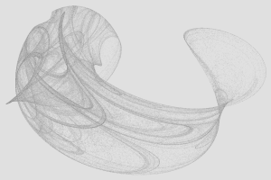](http://chaos-studio.io/#/explore/PDE3OkF0dHJhY3RvclNuYXBzaG90MzptYXA8MTQ6UGV0ZXJEZUpvbmdNYXA+Mzpybmc8Mjc6TGluZWFyQ29uZ3J1ZW50aWFsR2VuZXJhdG9yNDpzZWVkKDE1MDYxOTgyNzMwMDEpPj4=)
[](http://chaos-studio.io/#/explore/PDE3OkF0dHJhY3RvclNuYXBzaG90MzptYXA8MTQ6UGV0ZXJEZUpvbmdNYXA+Mzpybmc8Mjc6TGluZWFyQ29uZ3J1ZW50aWFsR2VuZXJhdG9yNDpzZWVkKDE1MDYxOTgzNDgxNjApPj4=)
[](http://chaos-studio.io/#/explore/PDE3OkF0dHJhY3RvclNuYXBzaG90MzptYXA8MTQ6UGV0ZXJEZUpvbmdNYXA+Mzpybmc8Mjc6TGluZWFyQ29uZ3J1ZW50aWFsR2VuZXJhdG9yNDpzZWVkKDE1MDYxOTg2NDE5NDgpPj4=)
[](http://chaos-studio.io/#/explore/PDE3OkF0dHJhY3RvclNuYXBzaG90MzptYXA8MTQ6UGV0ZXJEZUpvbmdNYXA+Mzpybmc8Mjc6TGluZWFyQ29uZ3J1ZW50aWFsR2VuZXJhdG9yNDpzZWVkKDE1MDYxOTg1MzA5NjApPj4=)

###### Exponent
[](http://chaos-studio.io/#/explore/PDE3OkF0dHJhY3RvclNuYXBzaG90MzptYXA8MTE6RXhwb25lbnRNYXA+Mzpybmc8Mjc6TGluZWFyQ29uZ3J1ZW50aWFsR2VuZXJhdG9yNDpzZWVkKDE1MDYyMDAyMzQ4MDUpPj4=)
[](http://chaos-studio.io/#/explore/PDE3OkF0dHJhY3RvclNuYXBzaG90MzptYXA8MTE6RXhwb25lbnRNYXA+Mzpybmc8Mjc6TGluZWFyQ29uZ3J1ZW50aWFsR2VuZXJhdG9yNDpzZWVkKDE1MDYyMDA0NDc0MDQpPj4=)
[](http://chaos-studio.io/#/explore/PDE3OkF0dHJhY3RvclNuYXBzaG90MzptYXA8MTE6RXhwb25lbnRNYXA+Mzpybmc8Mjc6TGluZWFyQ29uZ3J1ZW50aWFsR2VuZXJhdG9yNDpzZWVkKDE1MDYyMDA1MTQyNjIpPj4=)
[](http://chaos-studio.io/#/explore/PDE3OkF0dHJhY3RvclNuYXBzaG90MzptYXA8MTE6RXhwb25lbnRNYXA+Mzpybmc8Mjc6TGluZWFyQ29uZ3J1ZW50aWFsR2VuZXJhdG9yNDpzZWVkKDE1MDYyMDA1ODY1ODUpPj4=)

###### Tent
[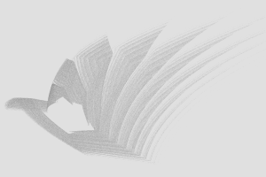](http://chaos-studio.io/#/explore/PDE3OkF0dHJhY3RvclNuYXBzaG90MzptYXA8NzpUZW50TWFwPjM6cm5nPDI3OkxpbmVhckNvbmdydWVudGlhbEdlbmVyYXRvcjQ6c2VlZCgxNTA2MTk5NjcyMzYxKT4+)
[](http://chaos-studio.io/#/explore/PDE3OkF0dHJhY3RvclNuYXBzaG90MzptYXA8NzpUZW50TWFwPjM6cm5nPDI3OkxpbmVhckNvbmdydWVudGlhbEdlbmVyYXRvcjQ6c2VlZCgxNTA2MTk5NzY3NzI3KT4+)
[](http://chaos-studio.io/#/explore/PDE3OkF0dHJhY3RvclNuYXBzaG90MzptYXA8NzpUZW50TWFwPjM6cm5nPDI3OkxpbmVhckNvbmdydWVudGlhbEdlbmVyYXRvcjQ6c2VlZCgxNTA2MjAwMTg0OTgzKT4+)
[](http://chaos-studio.io/#/explore/PDE3OkF0dHJhY3RvclNuYXBzaG90MzptYXA8NzpUZW50TWFwPjM6cm5nPDI3OkxpbmVhckNvbmdydWVudGlhbEdlbmVyYXRvcjQ6c2VlZCgxNTA2MjAwMDc4MzQ2KT4+)

###### AND & OR
[](http://chaos-studio.io/#/explore/PDE3OkF0dHJhY3RvclNuYXBzaG90MzptYXA8ODpBbmRPck1hcD4zOnJuZzwyNzpMaW5lYXJDb25ncnVlbnRpYWxHZW5lcmF0b3I0OnNlZWQoMTUwNjIwMDg2OTk2OSk+Pg==)
[](http://chaos-studio.io/#/explore/PDE3OkF0dHJhY3RvclNuYXBzaG90MzptYXA8ODpBbmRPck1hcD4zOnJuZzwyNzpMaW5lYXJDb25ncnVlbnRpYWxHZW5lcmF0b3I0OnNlZWQoMTUwNjIwMDkyNjg4NCk+Pg==)
[](http://chaos-studio.io/#/explore/PDE3OkF0dHJhY3RvclNuYXBzaG90MzptYXA8ODpBbmRPck1hcD4zOnJuZzwyNzpMaW5lYXJDb25ncnVlbnRpYWxHZW5lcmF0b3I0OnNlZWQoMTUwNjIwMDk4ODI1OCk+Pg==)
[](http://chaos-studio.io/#/explore/PDE3OkF0dHJhY3RvclNuYXBzaG90MzptYXA8ODpBbmRPck1hcD4zOnJuZzwyNzpMaW5lYXJDb25ncnVlbnRpYWxHZW5lcmF0b3I0OnNlZWQoMTUwNjIwMTA3OTY5OSk+Pg==)

